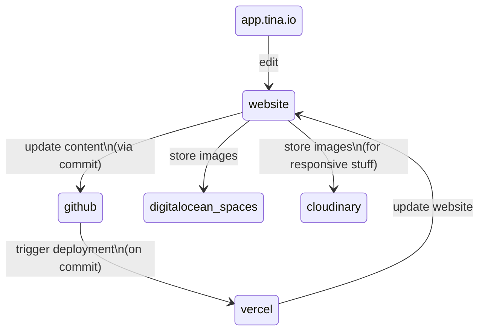
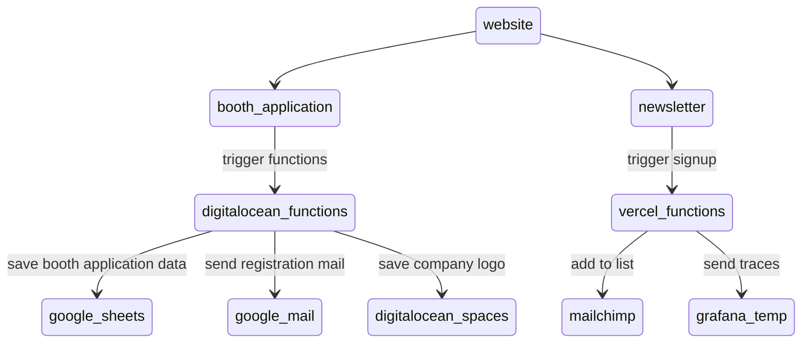

# Website

## Features

- [Tina Headless CMS](https://app.tina.io) for authentication, content modeling, visual editing and team management
- [External media provider (DigitalOcean Spaces)](https://tina.io/docs/reference/media/external/do-spaces/) to store media
- [Vercel](https://vercel.com) deployment to visually edit your site from the `/admin` route
- Local development workflow from the filesystem with a local GraqhQL server
- [Telemetry for serverless functions](https://startupnights.grafana.net)

## Requirements and integrations

- `git`, `nodejs` and `yarn` installed for local development
- [TinaCMS](https://app.tina.io) account for live editing
- [Grafana account](https://startupnights.grafana.net/a/cloud-home-app) 
- [DigitalOcean](https://www.digitalocean.com) account to manage the object storage and functions
- [Cloudinary](https://cloudinary.com) account for the image galleries
- [Vercel](https://vercel.com) account to manage environment variables, domains and deployments
- [Mailchimp](https://mailchimp.com/) account to manage the newsletter list and merge fields

## Overview

### Content organization and workflow

For development, branches can be used and upon pull request, a preview deployment will be deployed.

### Everything dynamic

- [DigitalOcean functions](https://github.com/Startup-Nights/functions)
- [Vercel functions](https://github.com/Startup-Nights/website/tree/main/pages/api)

## Development

- install the dependencies: `yarn install`
- copy `.env.example` to `.env.local` and update the variables
- run the server: `yarn dev`
- visit [https://localhost:3000](https://localhost:3000)

If you want to work with tito you have to use a proxy:

- run the ssl proxy: `yarn proxy` (https is required to show tito widget)
- visit [https://localhost:3001](https://localhost:3001)

## LICENSE

Licensed under the [Apache 2.0 license](./LICENSE).
