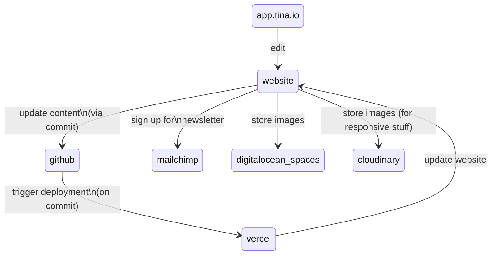

# Website

## Features

- [Tina Headless CMS](https://app.tina.io) for authentication, content modeling, visual editing and team management
- [External media provider (DigitalOcean Spaces)](https://tina.io/docs/reference/media/external/do-spaces/) to store media
- [Vercel](https://vercel.com) deployment to visually edit your site from the `/admin` route
- Local development workflow from the filesystem with a local GraqhQL server

## Requirements and integrations

- `git`, `nodejs` and `yarn` installed for local development
- [TinaCMS](https://app.tina.io) account for live editing
- [DigitalOcean](https://www.digitalocean.com) account to manage the object storage
- [Vercel](https://vercel.com) account to manage environment variables, domains and deployments
- [Mailchimp](https://mailchimp.com/) account to manage the newsletter list and merge fields

## Local Development

- install the dependencies: `yarn install`
- copy `.env.example` to `.env.local` and update the variables
- source the variables: `source .env.local`
- run the server: `yarn dev`
- run the ssl proxy: `yarn proxy` (https is required to show tito widget)
- visit [https://localhost:3001](https://localhost:3001)

### Local URLs

- http://localhost:3000 : browse the website
- http://localhost:3000/admin : connect to Tina Cloud and go in edit mode
- http://localhost:3000/exit-admin : log out of Tina Cloud
- http://localhost:4001/altair/ : GraphQL playground to test queries and browse the API documentation

### Structure

- `components/blocks` contains the "whole" blocks that the user can select
- `components/items` are parts of blocks - sometimes also nested!

## LICENSE

Licensed under the [Apache 2.0 license](./LICENSE).
